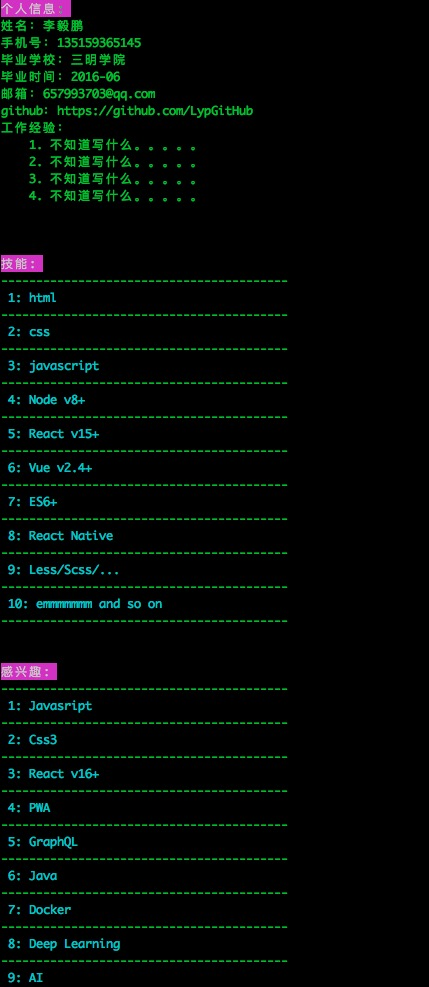

### Nodejs练习题1：多个批量异步任务串行化

##### 要求
- 给一个域名数组作为输入参数
- 使用dns协议查询这些域名对应的ip地址
- 汇总所有的ip地址，并作去重操作
- 批量访问这些ip地址对应的http服务，如果出错最多重试三次
- 获取http server的首页html内容，打印即可

##### 附加要求 (分别用三种技术实现)
- async.js
- Promise
- async/await


### 随机返回字符串

##### 要求
- 不传入参数则默认返回6位
- 返回值0-9 a-z A-Z中

### 根据模板返回字符串

##### 要求
- (010)111111转化为010-111111


### parse方法

```
  请实现方法 parse ，作用如下：
  var object = {
   b: { c: 4 }, d: [{ e: 5 }, { e: 6 }]
  };
  console.log( parse(object, ‘b.c’) == 4 ) //true
  console.log( parse(object, ‘d[0].e’) == 5 ) //true
  console.log( parse(object, ‘d.0.e’) == 5 ) //true
  console.log( parse(object, ‘d[1].e’) == 6 ) //true
  console.log( parse(object, ‘d.1.e’) == 6 ) //true
  console.log( parse(object, ‘f’) == ‘undefined’ ) //true

```

### 数串

设有n个正整数，将他们连接成一排，组成一个最大的多位整数。
如:n=3时，3个整数13,312,343,连成的最大整数为34331213。
如:n=4时,4个整数7,13,4,246连接成的最大整数为7424613。

### 找最大值

怎么通过一次遍历得到最大值且得到下标集合 (思考中)

### 稀土console 面试题
[稀土](https://juejin.im)

```bash
 ### 实时编译并输出js文件
 yarn build-watch
 ### 运行查看效果
 yarn nodeXitu
```



### 把间隙小的分组

```
给一组数字, 按要求分组:
  a. 已知分组的数量
  b. 把间隙小的放在一组
  c. 每一组的个数不超过指定的数.
  
比如: 给这组数字分组: [3, 4, 9, 12, 13, 22, 23, 32, 33, 40, 40, 42, 45, 50, 51, 55, 60, 64, 73, 73, 78, 81, 88, 89, 89, 92, 94, 94, 94, 95]
  a. 把间隙小的放在一组 
  b. 分成10组, 每组至少有一个元素.
  c. 每组最多有6个元素
```